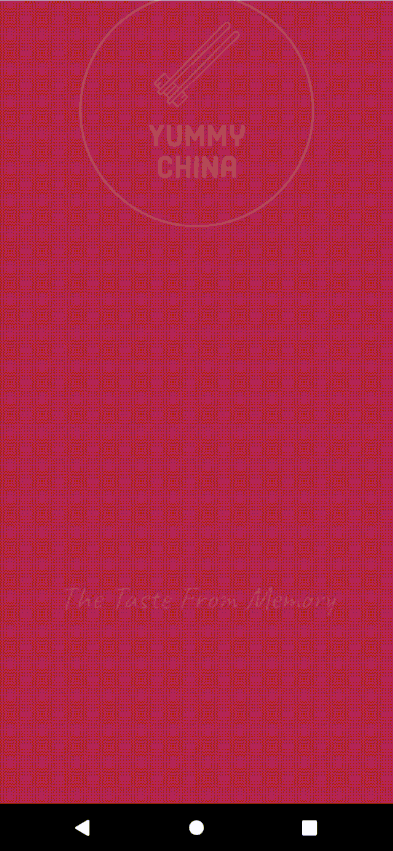
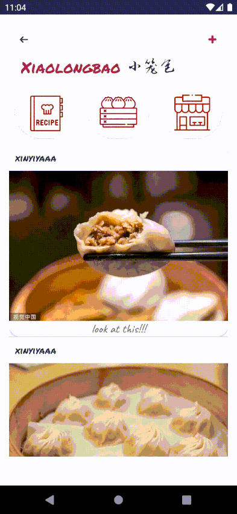

# YummyChina
[)](https://git.io/typing-svg)

## Overview:

### A platform for sharing Chinese food, learning about authentic food culture
- **Firebase** stores users' data(username, password, posts, comments...)
- Support users to view posts, and create posts in real time
  - Allow creating comments and viewing others' comments
- Display city category with its' representative **cusine**
  - Sub-entry for representative **dishes** under each cuisine
  - Three sub-entries under each dish
    - See **Recipe**
    - See food story of **origin**
    - See representative **resturants** (time-horoned, popular)

&nbsp&nbsp&nbsp&nbsp

## Features:
### Sign in/Sign up
- Splash screen with animation.
- Using firebase for authentication. Self-designed mordern UI.

&nbsp&nbsp&nbsp&nbsp

### Display cusine catergories, with entry for more..
- Under each cusine category, representative dishes are displayed
- Under each dish entry: 
  - View posts from users relates to that dish
  - Three buttons(sub-entries), first to show reciepe, second to show food story, thrid for searching restaurants

&nbsp&nbsp&nbsp&nbsp

### Post food image
- Display on the post view in time.
- Supports viewing post detail, adding comments.

&nbsp&nbsp&nbsp&nbsp

